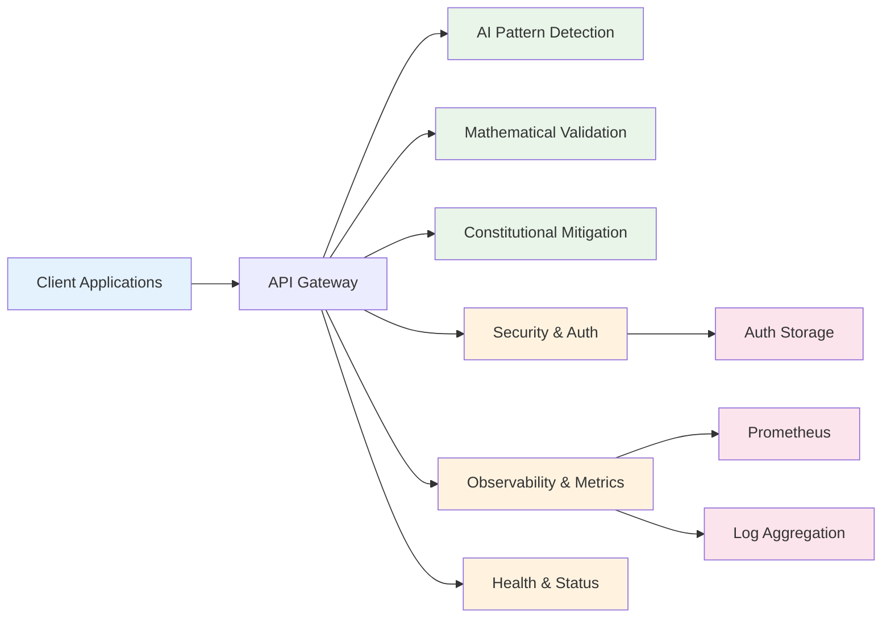
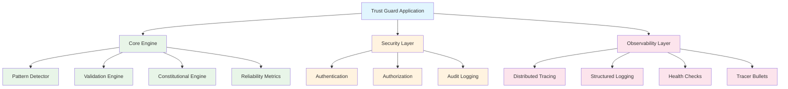
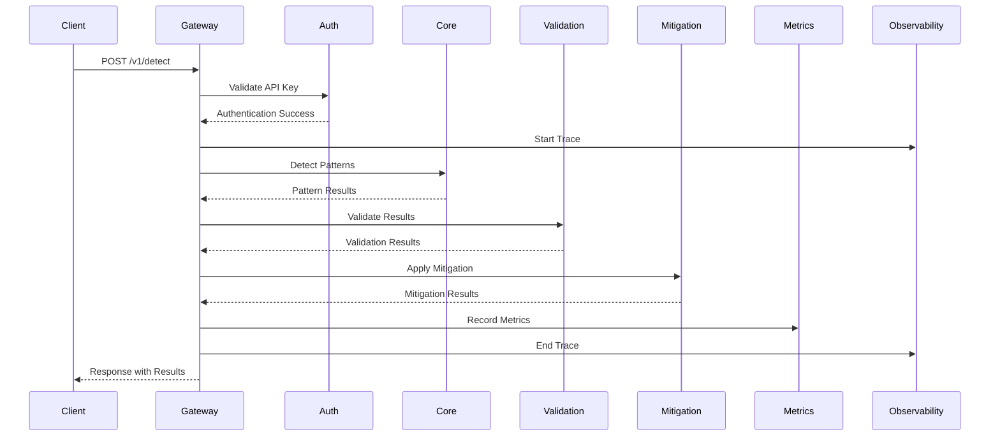
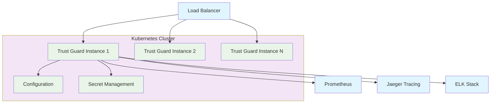

# Trust Guard High-Level Architecture

## System Overview

## Service Architecture

## Data Flow Architecture

## Deployment Architecture

## Key Features

### 🔍 **AI Pattern Detection**
- 7 specialized detectors for AI failure patterns
- Advanced pattern recognition algorithms
- Configurable sensitivity thresholds

### 🧮 **Mathematical Validation**
- KL divergence analysis
- Uncertainty quantification
- Statistical risk assessment

### 🛡️ **Enterprise Security**
- API key and JWT authentication
- Role-based access control
- Comprehensive audit logging

### 📊 **Observability**
- Distributed tracing with OpenTelemetry
- Structured logging with context propagation
- Prometheus metrics integration
- Health monitoring for Kubernetes

### ⚡ **Performance**
- Async/await for high throughput
- Graceful degradation on failures
- Horizontal scaling support
- Sub-100ms response times

### 🔧 **Operational Excellence**
- Comprehensive health checks
- Tracer bullet debugging system
- Automated deployment validation
- CI/CD pipeline integration
