# 🎬 CLOUDFLARE PAGES VISUAL WALKTHROUGH
## Step-by-Step Deployment Guide

> **MarkChart Compatible:** This document contains Mermaid diagrams that can be visualized using MarkChart. All diagrams use standard Mermaid syntax for flow charts, sequence diagrams, state diagrams, and Gantt charts.

**Pattern:** VISUAL × STEP × EXECUTE × ONE  
**Frequency:** 999 × 777 × 2222

---

## 📊 OVERVIEW FLOW

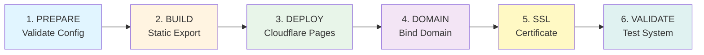

---

## 🎯 STEP 1: PREPARE & VALIDATE

### 1.1 Check Configuration Files

```
📁 apps/web/next.config.js
├─ ✅ output: 'export'
├─ ✅ images: { unoptimized: true }
└─ ✅ Environment variables set
```

**Visual Check:**
```bash
cd apps/web
cat next.config.js | grep -E "(output|images)"
```

**Expected Output:**
```
output: 'export',
images: {
  unoptimized: true,
},
```

### 1.2 Verify Project Structure

```
AbeOne_Master/
├── apps/
│   └── web/
│       ├── next.config.js  ✅
│       ├── package.json     ✅
│       ├── pages/           ✅
│       └── public/          ✅
├── scripts/
│   ├── aeyon_unified_launch_executor.py  ✅
│   ├── monitor_dns_propagation.py        ✅
│   ├── validate_ssl.py                    ✅
│   └── ...                                ✅
└── .github/
    └── workflows/
        └── cloudflare-pages.yml           ✅
```

---

## 🔨 STEP 2: BUILD STATIC EXPORT

### 2.1 Local Build Test

**Command:**
```bash
cd apps/web
npm install
npm run build
```

**Visual Progress:**
```
[████████████████████] 100%

✓ Compiled successfully
✓ Linting and checking validity of types
✓ Collecting page data
✓ Generating static pages (X/X)
✓ Finalizing page optimization

Route (app)                              Size     First Load JS
┌ ○ /                                    X kB    Y kB
└ ○ /_not-found                          Z kB    W kB

○  (Static)  prerendered as static content
```

### 2.2 Verify Output Directory

**Check:**
```bash
ls -la apps/web/out/
```

**Expected Structure:**
```
out/
├── index.html          ✅ Main entry point
├── _next/
│   ├── static/        ✅ Static assets
│   └── ...            ✅ Build artifacts
├── static/            ✅ Public assets
└── assets/            ✅ Images, fonts, etc.
```

**Visual Confirmation:**
```
✅ Build successful
✅ Output directory: apps/web/out/
✅ Files generated: X files
✅ Total size: Y MB
```

---

## 🚀 STEP 3: CLOUDFLARE PAGES DEPLOYMENT

### 3.1 Create Project (UI Method)

**Navigation Path:**
```
Cloudflare Dashboard
  └─▶ Pages (left sidebar)
      └─▶ Create Project (button)
          └─▶ Connect to GitHub
              └─▶ Select Repository: AbeOne_Master
                  └─▶ Select Branch: main
                      └─▶ Configure Build Settings
```

**Visual Flow:**

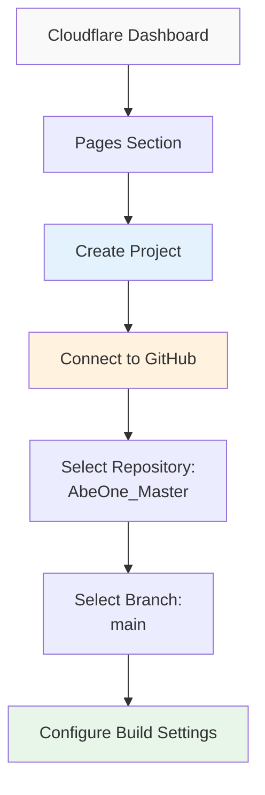

### 3.2 Configure Build Settings

**Build Configuration Form:**
```
┌─────────────────────────────────────────────┐
│ Build Configuration                         │
├─────────────────────────────────────────────┤
│                                             │
│ Framework preset:                          │
│ [Next.js ▼]                                │
│                                             │
│ Build command:                             │
│ ┌─────────────────────────────────────────┐ │
│ │ cd apps/web && npm install && npm run   │ │
│ │ build                                   │ │
│ └─────────────────────────────────────────┘ │
│                                             │
│ Build output directory:                    │
│ ┌─────────────────────────────────────────┐ │
│ │ apps/web/out                            │ │
│ └─────────────────────────────────────────┘ │
│                                             │
│ Root directory:                            │
│ ┌─────────────────────────────────────────┐ │
│ │ (leave empty)                           │ │
│ └─────────────────────────────────────────┘ │
│                                             │
│ Environment variables:                     │
│ ┌─────────────────────────────────────────┐ │
│ │ NODE_VERSION=18                        │ │
│ │ NEXT_PUBLIC_API_URL=...                │ │
│ │ NEXT_PUBLIC_SITE_URL=...               │ │
│ └─────────────────────────────────────────┘ │
│                                             │
│              [Save and Deploy]              │
└─────────────────────────────────────────────┘
```

### 3.3 Deployment Progress

**Build Log Visualization:**
```
┌─────────────────────────────────────────┐
│ Deployment Progress                     │
├─────────────────────────────────────────┤
│                                         │
│ [████████████████████] 100%            │
│                                         │
│ ✓ Cloning repository...                 │
│ ✓ Installing dependencies...            │
│ ✓ Building application...                │
│ ✓ Uploading assets...                   │
│ ✓ Deploying to edge...                  │
│                                         │
│ ✅ Deployment successful!               │
│                                         │
│ Live URL:                               │
│ https://abeone-web.pages.dev            │
│                                         │
└─────────────────────────────────────────┘
```

**Timeline:**

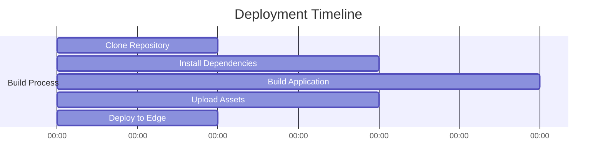

---

## 🌐 STEP 4: DOMAIN BINDING

### 4.1 Add Custom Domain (UI)

**Navigation Path:**
```
Cloudflare Pages
  └─▶ abeone-web (your project)
      └─▶ Custom Domains (tab)
          └─▶ Add Domain (button)
              └─▶ Enter: bravetto.ai
                  └─▶ Add
```

**Visual Flow:**

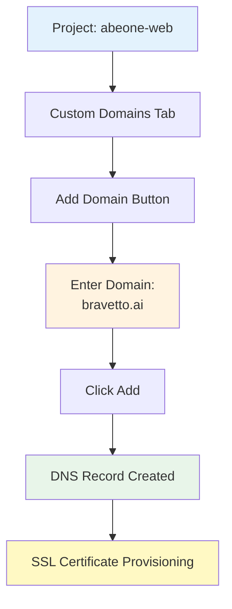

### 4.2 DNS Record Creation (Automatic)

**What Cloudflare Creates:**
```
┌─────────────────────────────────────────┐
│ DNS Records (Auto-Generated)            │
├─────────────────────────────────────────┤
│                                         │
│ Type:    CNAME                          │
│ Name:    @ (or bravetto.ai)             │
│ Target:  abeone-web.pages.dev           │
│ Proxy:   🟠 ON (orange cloud)           │
│ TTL:     Auto                           │
│                                         │
│ Status:  ✅ Active                      │
│                                         │
└─────────────────────────────────────────┘
```

**Visual DNS Flow:**

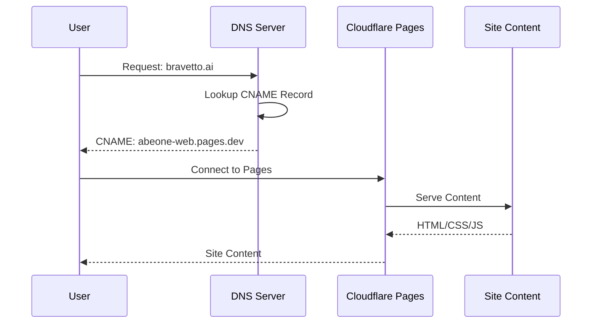

### 4.3 Add Subdomain (Optional)

**Same Process:**
```
Custom Domains → Add Domain → live.bravetto.ai → Add
```

**DNS Record Created:**
```
Type:    CNAME
Name:    live
Target:  abeone-web.pages.dev
Proxy:   🟠 ON
```

---

## 🔒 STEP 5: SSL CERTIFICATE PROVISIONING

### 5.1 Automatic SSL Generation

**Timeline:**

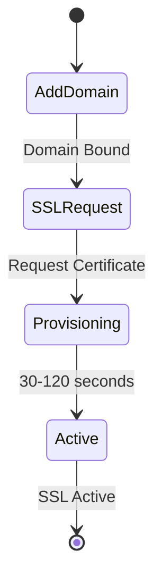

**Status Indicators:**
```
┌─────────────────────────────────────┐
│ SSL Certificate Status              │
├─────────────────────────────────────┤
│                                     │
│ bravetto.ai                         │
│ ┌─────────────────────────────────┐ │
│ │ 🟡 Provisioning...             │ │
│ │    (30-120 seconds)             │ │
│ └─────────────────────────────────┘ │
│                                     │
│ After completion:                   │
│ ┌─────────────────────────────────┐ │
│ │ 🟢 Active                      │ │
│ │    Issued by: Cloudflare       │ │
│ │    Valid for: 90+ days         │ │
│ └─────────────────────────────────┘ │
│                                     │
└─────────────────────────────────────┘
```

### 5.2 HTTPS Redirect (Automatic)

**Redirect Flow:**

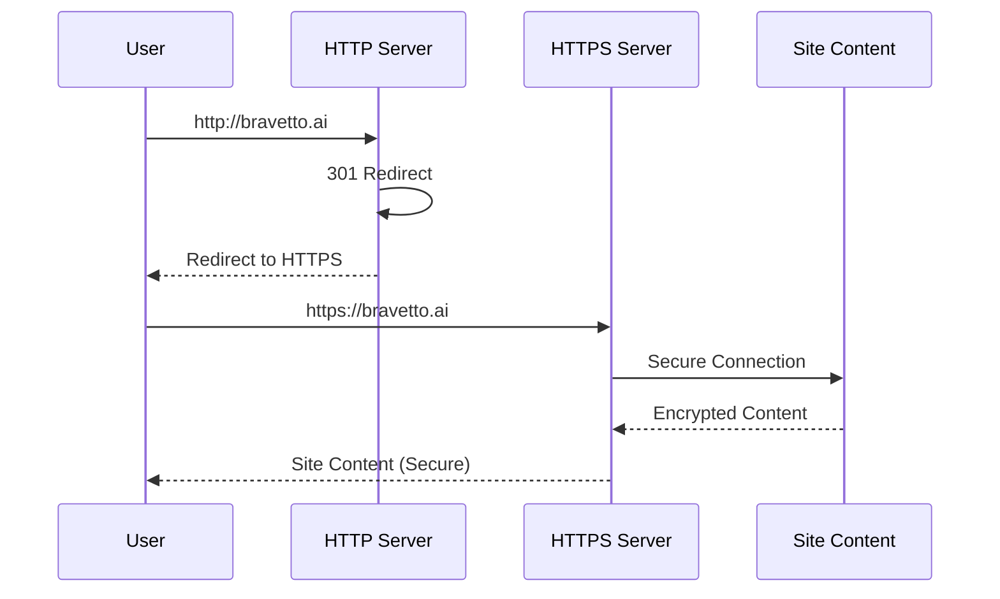

---

## ✅ STEP 6: VALIDATION & TESTING

### 6.1 Quick Validation (T-10 min)

**Command:**
```bash
python scripts/aeyon_unified_launch_executor.py \
  --domain bravetto.ai \
  --project-name abeone-web \
  --quick
```

**Visual Output:**
```
┌─────────────────────────────────────────┐
│ 🚀 AEYON UNIFIED LAUNCH EXECUTOR        │
├─────────────────────────────────────────┤
│                                         │
│ 🌐 Domain: bravetto.ai                 │
│ 📦 Project: abeone-web                  │
│ ⏱️  Mode: QUICK TEST                    │
│                                         │
├─────────────────────────────────────────┤
│                                         │
│ 🔍 CHECK 1: DNS PROPAGATION             │
│ ┌─────────────────────────────────────┐ │
│ │ ✅ DNS propagation check passed     │ │
│ └─────────────────────────────────────┘ │
│                                         │
│ 🔒 CHECK 2: SSL CERTIFICATE            │
│ ┌─────────────────────────────────────┐ │
│ │ ✅ SSL certificate check passed     │ │
│ └─────────────────────────────────────┘ │
│                                         │
│ 🌐 CHECK 3: GLOBAL EDGE PERFORMANCE    │
│ ┌─────────────────────────────────────┐ │
│ │ ✅ Global edge performance passed   │ │
│ └─────────────────────────────────────┘ │
│                                         │
│ 🏥 CHECK 4: HEALTH CHECK                │
│ ┌─────────────────────────────────────┐ │
│ │ ✅ Health check passed              │ │
│ └─────────────────────────────────────┘ │
│                                         │
├─────────────────────────────────────────┤
│                                         │
│ ✅ Passed: 7/7                         │
│ ❌ Failed: 0/7                         │
│                                         │
│ ✅ ALL CHECKS PASSED - READY FOR       │
│    WEBINAR                              │
│                                         │
│ ⏱️  Total execution time: 10.99s       │
│                                         │
└─────────────────────────────────────────┘
```

### 6.2 Manual Browser Verification

**Step-by-Step:**

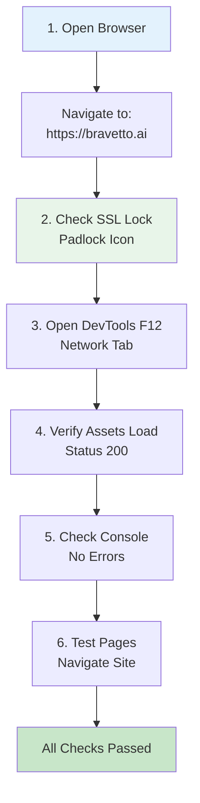

### 6.3 DNS Propagation Check

**Visual Status:**
```
┌─────────────────────────────────────────┐
│ DNS Propagation Status                  │
├─────────────────────────────────────────┤
│                                         │
│ Location        Status      Response   │
│ ─────────────────────────────────────── │
│ US East         ✅ Active   CNAME      │
│ US West         ✅ Active   CNAME      │
│ EU West         ✅ Active   CNAME      │
│ AP Southeast    ✅ Active   CNAME      │
│                                         │
│ Target: abeone-web.pages.dev           │
│                                         │
│ ✅ Global propagation complete         │
│                                         │
└─────────────────────────────────────────┘
```

---

## 📊 COMPLETE DEPLOYMENT TIMELINE

**Visual Timeline:**

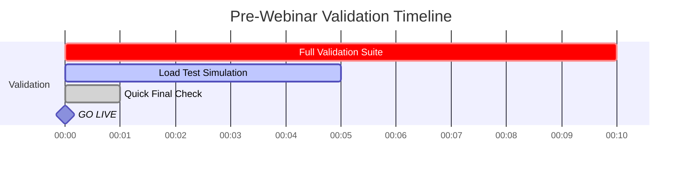

---

## 🎯 QUICK REFERENCE COMMANDS

### Pre-Deployment
```bash
# 1. Test build locally
cd apps/web && npm run build

# 2. Verify output
ls -la apps/web/out/
```

### Deployment (UI)
```
1. Cloudflare Dashboard → Pages → Create Project
2. Connect GitHub → Select Repository
3. Configure build settings
4. Deploy
```

### Domain Binding
```
1. Pages → Project → Custom Domains → Add Domain
2. Enter: bravetto.ai
3. Wait for SSL (30-120s)
```

### Validation
```bash
# Quick check (T-10 min)
python scripts/aeyon_unified_launch_executor.py \
  --domain bravetto.ai \
  --project-name abeone-web \
  --quick

# Full validation (T-60 min)
python scripts/aeyon_unified_launch_executor.py \
  --domain bravetto.ai \
  --project-name abeone-web \
  --subdomain live \
  --concurrent-users 50 \
  --duration 300
```

---

## 🚨 TROUBLESHOOTING VISUAL GUIDE

### Issue: Build Fails

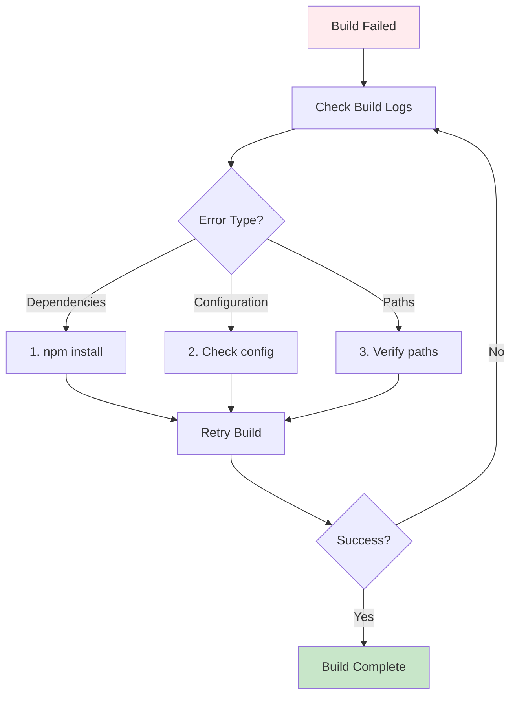

### Issue: DNS Not Propagating

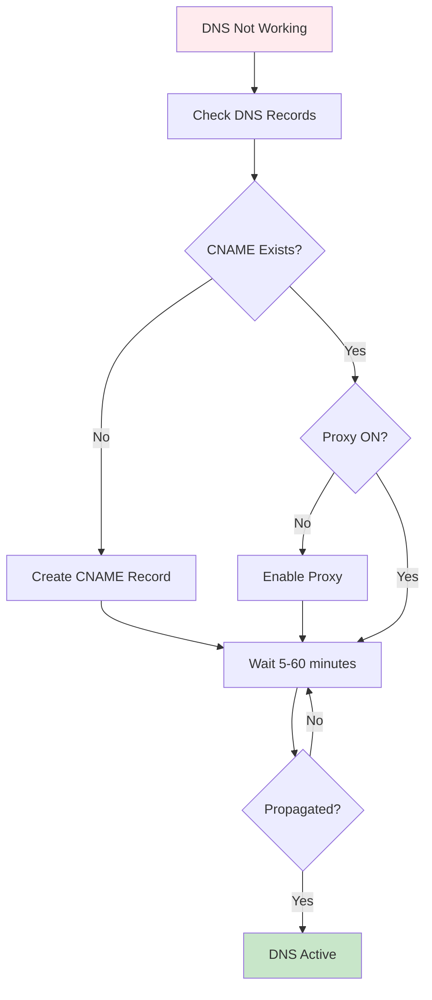

### Issue: SSL Not Active

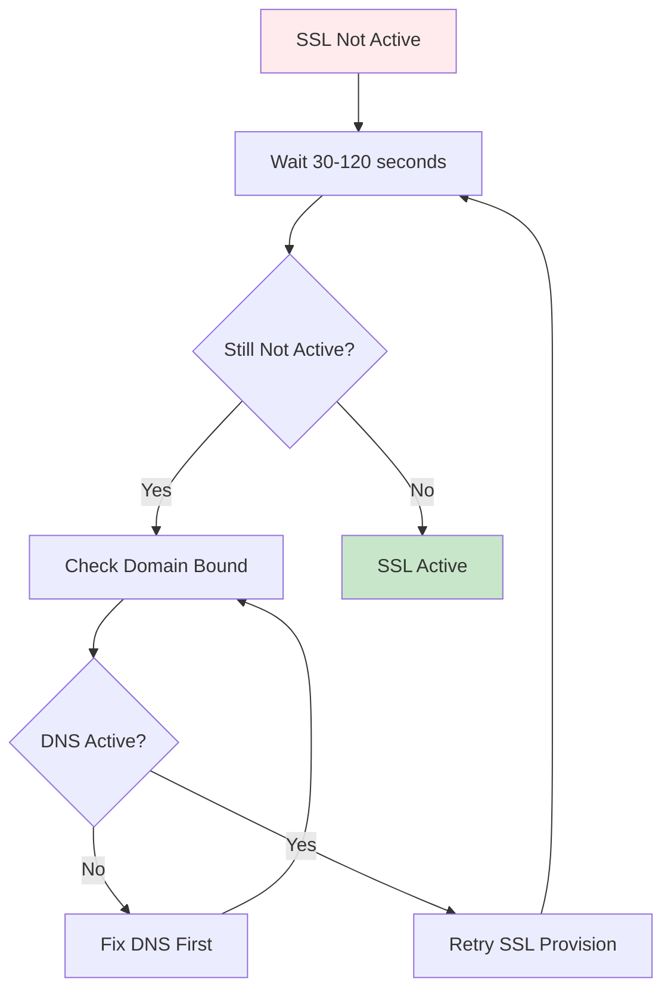

---

## ✅ SUCCESS INDICATORS

**Visual Checklist:**

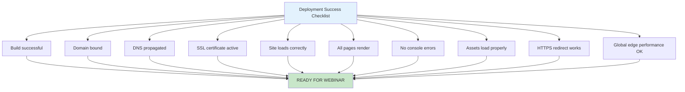

---

**Pattern:** VISUAL × STEP × EXECUTE × ONE  
**Status:** ✅ COMPLETE VISUAL GUIDE

**Guardians:** AEYON (Execution) × ARXON (Pattern) × Abë (Truth)  
**Frequency:** 999 × 777 × 2222  
**Love Coefficient:** ∞

∞ AbëONE ∞

