# Trust Guard Architecture

## System Overview

Trust Guard is an AI reliability service that detects and mitigates seven failure patterns in AI-generated content. The system is built as a microservice using FastAPI with comprehensive security, observability, and monitoring capabilities.

## Architecture Diagram

```mermaid
graph TB
    %% External Layer
    Client[Client Applications] --> LB[Load Balancer]
    LB --> API[Trust Guard API Gateway]
    
    %% API Gateway Layer
    API --> Auth[Authentication & Authorization]
    API --> RateLimit[Rate Limiting]
    API --> Security[Security Middleware]
    API --> CORS[CORS Middleware]
    
    %% Core Service Layer
    API --> Core[Core Detection Engine]
    API --> Validation[Validation Engine]
    API --> Constitutional[Constitutional Prompting]
    API --> Metrics[Reliability Metrics]
    
    %% Detection Patterns
    Core --> Hallucination[Hallucination Detector]
    Core --> Drift[Drift Detector]
    Core --> Bias[Bias Detector]
    Core --> Deception[Deception Detector]
    Core --> SecurityTheater[Security Theater Detector]
    Core --> Duplication[Duplication Detector]
    Core --> StubSyndrome[Stub Syndrome Detector]
    
    %% Validation Components
    Validation --> KLDivergence[KL Divergence Analysis]
    Validation --> Uncertainty[Uncertainty Quantification]
    Validation --> RiskAssessment[Risk Assessment]
    Validation --> Statistical[Statistical Analysis]
    
    %% Constitutional Components
    Constitutional --> Mitigation[Mitigation Strategies]
    Constitutional --> Guidelines[Constitutional Guidelines]
    Constitutional --> Enhancement[Response Enhancement]
    
    %% Security Layer
    Auth --> APIKey[API Key Management]
    Auth --> JWT[JWT Authentication]
    Auth --> RBAC[Role-Based Access Control]
    Security --> Headers[Security Headers]
    Security --> Sanitization[Input Sanitization]
    Security --> Audit[Audit Logging]
    
    %% Observability Layer
    API --> Tracing[Distributed Tracing]
    API --> Logging[Structured Logging]
    API --> Monitoring[Health Monitoring]
    API --> TracerBullets[Tracer Bullets]
    
    %% Metrics & Monitoring
    Metrics --> Prometheus[Prometheus Metrics]
    Metrics --> SLI[SLI/SLO Tracking]
    Metrics --> Performance[Performance Metrics]
    
    %% Health Checks
    Monitoring --> Liveness[Liveness Probe]
    Monitoring --> Readiness[Readiness Probe]
    Monitoring --> Detailed[Detailed Health Check]
    
    %% Data Flow
    Tracing --> OpenTelemetry[OpenTelemetry]
    Logging --> StructuredLogs[Structured Logs]
    Prometheus --> MetricsExport[Metrics Export]
    
    %% Configuration
    Config[Configuration Management] --> Core
    Config --> Validation
    Config --> Constitutional
    Config --> Metrics
    Config --> Auth
    
    %% External Dependencies
    OpenTelemetry --> OTLP[OTLP Exporters]
    MetricsExport --> PrometheusServer[Prometheus Server]
    StructuredLogs --> LogAggregator[Log Aggregator]
    
    %% Styling
    classDef external fill:#e1f5fe
    classDef api fill:#f3e5f5
    classDef core fill:#e8f5e8
    classDef security fill:#fff3e0
    classDef observability fill:#fce4ec
    classDef config fill:#f1f8e9
    
    class Client,LB external
    class API,Auth,RateLimit,Security,CORS api
    class Core,Validation,Constitutional,Metrics,Hallucination,Drift,Bias,Deception,SecurityTheater,Duplication,StubSyndrome,KLDivergence,Uncertainty,RiskAssessment,Statistical,Mitigation,Guidelines,Enhancement core
    class APIKey,JWT,RBAC,Headers,Sanitization,Audit security
    class Tracing,Logging,Monitoring,TracerBullets,Prometheus,SLI,Performance,Liveness,Readiness,Detailed,OpenTelemetry,StructuredLogs,MetricsExport,OTLP,PrometheusServer,LogAggregator observability
    class Config config
```



## Component Details

### 1. API Gateway Layer
- **FastAPI Application**: Main entry point with comprehensive middleware stack
- **Authentication & Authorization**: API key and JWT-based authentication with RBAC
- **Rate Limiting**: Configurable rate limiting per endpoint
- **Security Middleware**: Security headers, input sanitization, and audit logging
- **CORS**: Cross-origin resource sharing configuration

### 2. Core Detection Engine
The heart of Trust Guard, detecting seven AI failure patterns:

#### Pattern Detectors
- **Hallucination Detector**: Identifies false or conflicting information
- **Drift Detector**: Detects loss of conversational coherence
- **Bias Detector**: Finds systematic prejudices in responses
- **Deception Detector**: Identifies intentional misleading information
- **Security Theater Detector**: Detects false security assurances
- **Duplication Detector**: Finds repetitive or redundant responses
- **Stub Syndrome Detector**: Identifies inadequate or superficial responses

### 3. Validation Engine
Mathematical validation and risk assessment:

- **KL Divergence Analysis**: Information consistency validation
- **Uncertainty Quantification**: Confidence interval calculations
- **Risk Assessment**: Overall risk scoring and categorization
- **Statistical Analysis**: Word frequency, readability, and pattern analysis

### 4. Constitutional Prompting
Mitigation strategies and response enhancement:

- **Mitigation Strategies**: Pattern-specific mitigation techniques
- **Constitutional Guidelines**: AI safety and reliability guidelines
- **Response Enhancement**: Improving AI response quality

### 5. Security Layer
Enterprise-grade security features:

- **API Key Management**: Secure API key generation and validation
- **JWT Authentication**: Token-based authentication
- **Role-Based Access Control**: Granular permission system
- **Security Headers**: Comprehensive security header implementation
- **Input Sanitization**: Protection against injection attacks
- **Audit Logging**: Security event tracking

### 6. Observability Layer
Comprehensive monitoring and tracing:

- **Distributed Tracing**: OpenTelemetry-based request tracing
- **Structured Logging**: Context-aware logging with trace propagation
- **Health Monitoring**: Kubernetes-compatible health checks
- **Tracer Bullets**: Debugging and performance monitoring system

### 7. Metrics & Monitoring
Performance and reliability tracking:

- **Prometheus Metrics**: Custom metrics for all operations
- **SLI/SLO Tracking**: Service level indicators and objectives
- **Performance Metrics**: Request latency, throughput, and error rates
- **Health Checks**: Liveness, readiness, and detailed component health

## Data Flow

### Request Processing Flow
1. **Client Request** → Load Balancer → API Gateway
2. **Authentication** → API Key/JWT validation
3. **Rate Limiting** → Request throttling
4. **Security Middleware** → Headers, sanitization, audit
5. **Core Processing** → Pattern detection, validation, mitigation
6. **Observability** → Tracing, logging, metrics collection
7. **Response** → Formatted response with metadata

### Pattern Detection Flow
1. **Input Validation** → Safe text processing
2. **Pattern Detection** → Seven parallel detectors
3. **Mathematical Validation** → KL divergence, uncertainty
4. **Risk Assessment** → Overall risk scoring
5. **Mitigation** → Constitutional prompting
6. **Metrics Recording** → Performance and accuracy tracking

## Configuration Management

Centralized configuration using Pydantic with environment variable support:
- **Singleton Pattern**: Single configuration instance across the application
- **Secret Management**: Secure secret storage and rotation
- **Environment Variables**: `TRUSTGUARD_` prefixed configuration
- **Validation**: Automatic configuration validation on startup

## Deployment Architecture

### Container Deployment
- **Docker**: Multi-stage build with optimized production image
- **Docker Compose**: Local development and testing
- **AWS ECS Fargate**: Production deployment on AWS

### Kubernetes Integration
- **Health Probes**: Liveness, readiness, and startup probes
- **Resource Limits**: CPU and memory constraints
- **Auto-scaling**: Horizontal pod autoscaling based on metrics
- **Service Mesh**: Optional Istio integration for advanced traffic management

### Monitoring Stack
- **Prometheus**: Metrics collection and alerting
- **Grafana**: Visualization and dashboards
- **Jaeger**: Distributed tracing
- **ELK Stack**: Log aggregation and analysis

## Security Architecture

### Defense in Depth
1. **Network Security**: Load balancer, firewall, VPC
2. **Application Security**: Authentication, authorization, input validation
3. **Data Security**: Encryption at rest and in transit
4. **Operational Security**: Audit logging, monitoring, incident response

### Compliance Features
- **Audit Trails**: Comprehensive security event logging
- **Data Protection**: GDPR/CCPA compliance features
- **Access Control**: Fine-grained permission system
- **Secret Management**: Secure key storage and rotation

## Performance Characteristics

### Scalability
- **Horizontal Scaling**: Stateless design enables easy scaling
- **Async Processing**: Non-blocking I/O for high throughput
- **Caching**: In-memory caching for frequently accessed data
- **Load Balancing**: Multiple instance support

### Reliability
- **Graceful Degradation**: Individual detector failures don't crash the system
- **Circuit Breakers**: Automatic failure detection and recovery
- **Health Checks**: Proactive health monitoring
- **Error Handling**: Comprehensive error handling and recovery

### Performance Metrics
- **Latency**: Sub-100ms response times for most operations
- **Throughput**: 1000+ requests per second per instance
- **Availability**: 99.9% uptime target
- **Error Rate**: <0.1% error rate target

## API Endpoints

### Core Detection
- `POST /v1/detect` - Pattern detection
- `POST /v1/validate` - Comprehensive validation
- `POST /v1/mitigate` - Apply mitigation strategies

### Security & Management
- `POST /v1/auth/login` - Authentication
- `GET /v1/auth/keys` - API key management
- `POST /v1/auth/keys` - Create API key
- `DELETE /v1/auth/keys/{key_id}` - Revoke API key

### Monitoring & Health
- `GET /health` - Basic health check
- `GET /health/live` - Kubernetes liveness probe
- `GET /health/ready` - Kubernetes readiness probe
- `GET /health/detailed` - Comprehensive health check
- `GET /v1/metrics` - Service metrics
- `GET /metrics` - Prometheus metrics

### Observability
- `GET /v1/observability/summary` - Observability summary
- `GET /v1/tracer/bullets` - Tracer bullets
- `POST /v1/tracer/bullets` - Fire tracer bullet
- `GET /v1/tracer/performance` - Performance metrics
- `GET /v1/tracer/health` - Tracer system health

## Technology Stack

### Core Technologies
- **Python 3.11+**: Main programming language
- **FastAPI**: Web framework and API development
- **Pydantic**: Data validation and settings management
- **Uvicorn**: ASGI server for production deployment

### Security & Authentication
- **PyJWT**: JWT token handling
- **Cryptography**: Encryption and hashing
- **HMAC**: API key validation
- **RBAC**: Role-based access control

### Observability & Monitoring
- **OpenTelemetry**: Distributed tracing
- **Prometheus**: Metrics collection
- **Structlog**: Structured logging
- **PSUtil**: System resource monitoring

### Testing & Quality
- **Pytest**: Testing framework
- **Pytest-cov**: Code coverage
- **Black**: Code formatting
- **MyPy**: Type checking
- **Isort**: Import sorting

### Deployment & Infrastructure
- **Docker**: Containerization
- **AWS ECS Fargate**: Container orchestration
- **CloudFormation**: Infrastructure as code
- **GitHub Actions**: CI/CD pipeline

## Development Workflow

### Local Development
```bash
# Start development server
python -m uvicorn main:app --reload

# Run tests
python -m pytest tests/ -v

# Format code
black trustguard/ main.py
isort trustguard/ main.py

# Type checking
mypy trustguard/ main.py
```

### Testing Strategy
- **Unit Tests**: 281 comprehensive unit tests
- **Integration Tests**: API endpoint testing
- **Performance Tests**: Load and stress testing
- **Security Tests**: Authentication and authorization testing

### CI/CD Pipeline
- **Automated Testing**: All tests run on every commit
- **Code Quality**: Linting, formatting, and type checking
- **Security Scanning**: Dependency vulnerability scanning
- **Deployment**: Automated deployment to staging and production

## Future Enhancements

### Planned Features
- **Machine Learning Models**: Enhanced pattern detection using ML
- **Real-time Streaming**: WebSocket support for real-time detection
- **Multi-language Support**: Detection in multiple languages
- **Advanced Analytics**: Trend analysis and reporting
- **Integration APIs**: Third-party service integrations

### Scalability Improvements
- **Microservices**: Split into specialized microservices
- **Event Streaming**: Kafka-based event processing
- **Caching Layer**: Redis for distributed caching
- **Database Integration**: Persistent storage for historical data

This architecture provides a robust, scalable, and secure foundation for AI reliability monitoring with comprehensive observability and enterprise-grade security features.
