# Trust Guard Architecture Diagram

```mermaid
graph TB
    %% External Layer
    Client[Client Applications] --> LB[Load Balancer]
    LB --> API[Trust Guard API Gateway]
    
    %% API Gateway Layer
    API --> Auth[Authentication & Authorization]
    API --> RateLimit[Rate Limiting]
    API --> Security[Security Middleware]
    API --> CORS[CORS Middleware]
    
    %% Core Service Layer
    API --> Core[Core Detection Engine]
    API --> Validation[Validation Engine]
    API --> Constitutional[Constitutional Prompting]
    API --> Metrics[Reliability Metrics]
    
    %% Detection Patterns
    Core --> Hallucination[Hallucination Detector]
    Core --> Drift[Drift Detector]
    Core --> Bias[Bias Detector]
    Core --> Deception[Deception Detector]
    Core --> SecurityTheater[Security Theater Detector]
    Core --> Duplication[Duplication Detector]
    Core --> StubSyndrome[Stub Syndrome Detector]
    
    %% Validation Components
    Validation --> KLDivergence[KL Divergence Analysis]
    Validation --> Uncertainty[Uncertainty Quantification]
    Validation --> RiskAssessment[Risk Assessment]
    Validation --> Statistical[Statistical Analysis]
    
    %% Constitutional Components
    Constitutional --> Mitigation[Mitigation Strategies]
    Constitutional --> Guidelines[Constitutional Guidelines]
    Constitutional --> Enhancement[Response Enhancement]
    
    %% Security Layer
    Auth --> APIKey[API Key Management]
    Auth --> JWT[JWT Authentication]
    Auth --> RBAC[Role-Based Access Control]
    Security --> Headers[Security Headers]
    Security --> Sanitization[Input Sanitization]
    Security --> Audit[Audit Logging]
    
    %% Observability Layer
    API --> Tracing[Distributed Tracing]
    API --> Logging[Structured Logging]
    API --> Monitoring[Health Monitoring]
    API --> TracerBullets[Tracer Bullets]
    
    %% Metrics & Monitoring
    Metrics --> Prometheus[Prometheus Metrics]
    Metrics --> SLI[SLI/SLO Tracking]
    Metrics --> Performance[Performance Metrics]
    
    %% Health Checks
    Monitoring --> Liveness[Liveness Probe]
    Monitoring --> Readiness[Readiness Probe]
    Monitoring --> Detailed[Detailed Health Check]
    
    %% Data Flow
    Tracing --> OpenTelemetry[OpenTelemetry]
    Logging --> StructuredLogs[Structured Logs]
    Prometheus --> MetricsExport[Metrics Export]
    
    %% Configuration
    Config[Configuration Management] --> Core
    Config --> Validation
    Config --> Constitutional
    Config --> Metrics
    Config --> Auth
    
    %% External Dependencies
    OpenTelemetry --> OTLP[OTLP Exporters]
    MetricsExport --> PrometheusServer[Prometheus Server]
    StructuredLogs --> LogAggregator[Log Aggregator]
    
    %% Styling
    classDef external fill:#e1f5fe
    classDef api fill:#f3e5f5
    classDef core fill:#e8f5e8
    classDef security fill:#fff3e0
    classDef observability fill:#fce4ec
    classDef config fill:#f1f8e9
    
    class Client,LB external
    class API,Auth,RateLimit,Security,CORS api
    class Core,Validation,Constitutional,Metrics,Hallucination,Drift,Bias,Deception,SecurityTheater,Duplication,StubSyndrome,KLDivergence,Uncertainty,RiskAssessment,Statistical,Mitigation,Guidelines,Enhancement core
    class APIKey,JWT,RBAC,Headers,Sanitization,Audit security
    class Tracing,Logging,Monitoring,TracerBullets,Prometheus,SLI,Performance,Liveness,Readiness,Detailed,OpenTelemetry,StructuredLogs,MetricsExport,OTLP,PrometheusServer,LogAggregator observability
    class Config config
```

## Component Legend

- **Blue (External)**: Client applications and load balancer
- **Purple (API)**: API gateway and middleware components
- **Green (Core)**: Core detection, validation, and mitigation engines
- **Orange (Security)**: Authentication, authorization, and security features
- **Pink (Observability)**: Monitoring, logging, tracing, and metrics
- **Light Green (Config)**: Configuration management

## Key Relationships

1. **Client → API Gateway**: All requests flow through the API gateway
2. **API Gateway → Core Services**: Routes to detection, validation, and mitigation
3. **Core Services → Pattern Detectors**: Seven specialized AI failure pattern detectors
4. **Security Layer**: Protects all components with authentication and authorization
5. **Observability Layer**: Monitors and traces all operations
6. **Configuration**: Centralized configuration management for all components
