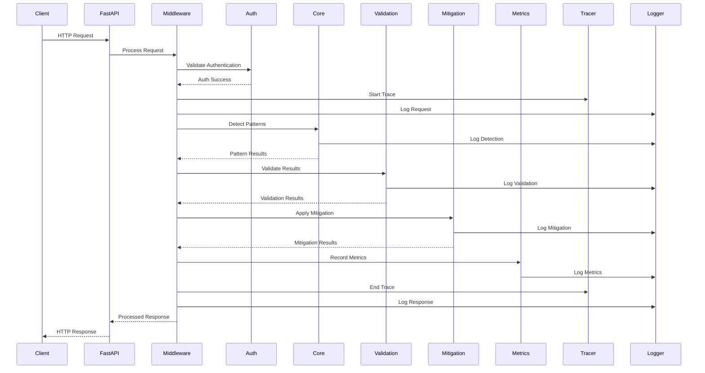
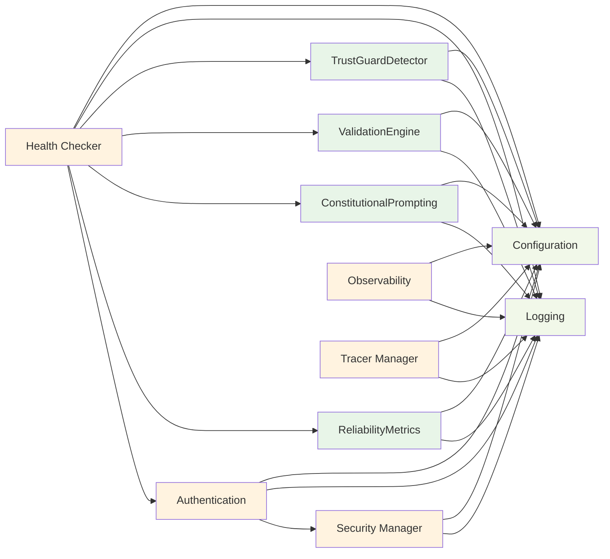
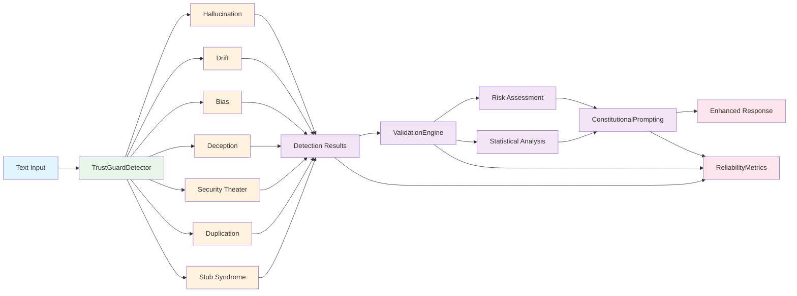
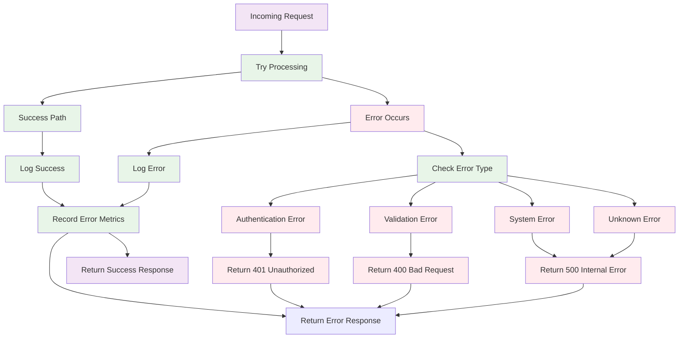
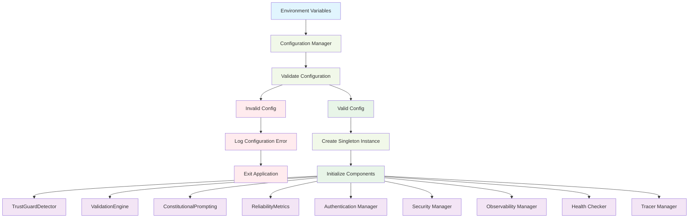

# Trust Guard Component Interactions

## Component Interaction Diagram

```mermaid
graph TB
    %% Main Application Entry Point
    Main[main.py] --> Config[Configuration Manager]
    Main --> Logger[Logging System]
    Main --> Auth[Authentication Manager]
    Main --> Security[Security Manager]
    Main --> Observability[Observability Manager]
    Main --> Health[Health Checker]
    Main --> Tracer[Tracer Manager]
    
    %% Core Components
    Main --> Detector[TrustGuardDetector]
    Main --> Validator[ValidationEngine]
    Main --> Constitutional[ConstitutionalPrompting]
    Main --> Metrics[ReliabilityMetrics]
    
    %% API Endpoints
    Main --> DetectAPI[/v1/detect]
    Main --> ValidateAPI[/v1/validate]
    Main --> MitigateAPI[/v1/mitigate]
    Main --> HealthAPI[/health/*]
    Main --> MetricsAPI[/v1/metrics]
    Main --> TracerAPI[/v1/tracer/*]
    
    %% Component Dependencies
    DetectAPI --> Detector
    DetectAPI --> Validator
    DetectAPI --> Metrics
    DetectAPI --> Tracer
    DetectAPI --> Observability
    
    ValidateAPI --> Validator
    ValidateAPI --> Metrics
    ValidateAPI --> Tracer
    
    MitigateAPI --> Constitutional
    MitigateAPI --> Metrics
    MitigateAPI --> Tracer
    
    HealthAPI --> Health
    HealthAPI --> Detector
    HealthAPI --> Validator
    HealthAPI --> Constitutional
    HealthAPI --> Metrics
    HealthAPI --> Auth
    
    MetricsAPI --> Metrics
    TracerAPI --> Tracer
    
    %% Cross-Component Dependencies
    Detector --> Logger
    Validator --> Logger
    Constitutional --> Logger
    Metrics --> Logger
    Auth --> Logger
    Security --> Logger
    Observability --> Logger
    Health --> Logger
    Tracer --> Logger
    
    %% Configuration Dependencies
    Config --> Detector
    Config --> Validator
    Config --> Constitutional
    Config --> Metrics
    Config --> Auth
    Config --> Security
    Config --> Observability
    Config --> Health
    Config --> Tracer
    
    %% Styling
    classDef main fill:#e1f5fe
    classDef core fill:#e8f5e8
    classDef api fill:#f3e5f5
    classDef support fill:#fff3e0
    classDef config fill:#f1f8e9
    
    class Main main
    class Detector,Validator,Constitutional,Metrics core
    class DetectAPI,ValidateAPI,MitigateAPI,HealthAPI,MetricsAPI,TracerAPI api
    class Auth,Security,Observability,Health,Tracer,Logger support
    class Config config
```

## Request Flow Diagram



## Component Dependencies

### Core Dependencies


## Data Flow Between Components

### Pattern Detection Flow


## Error Handling Flow



## Configuration Flow



## Key Integration Points

### 1. **Configuration Integration**
- All components receive configuration through the singleton `TrustGuardConfig`
- Environment variables are validated and transformed into component-specific settings
- Secret management provides secure access to sensitive configuration

### 2. **Logging Integration**
- All components use the centralized logging system
- Trace context propagation ensures request correlation across components
- Structured logging provides consistent log format

### 3. **Metrics Integration**
- All operations record metrics through the `ReliabilityMetrics` component
- Prometheus integration provides external metrics collection
- Performance and business metrics are tracked consistently

### 4. **Security Integration**
- Authentication and authorization are enforced at the API gateway level
- Security middleware provides input sanitization and audit logging
- All components respect security policies and permissions

### 5. **Observability Integration**
- Distributed tracing tracks requests across all components
- Health checks monitor component status and dependencies
- Tracer bullets provide debugging and performance monitoring

### 6. **Error Handling Integration**
- Consistent error handling across all components
- Graceful degradation when individual components fail
- Comprehensive error logging and metrics collection
